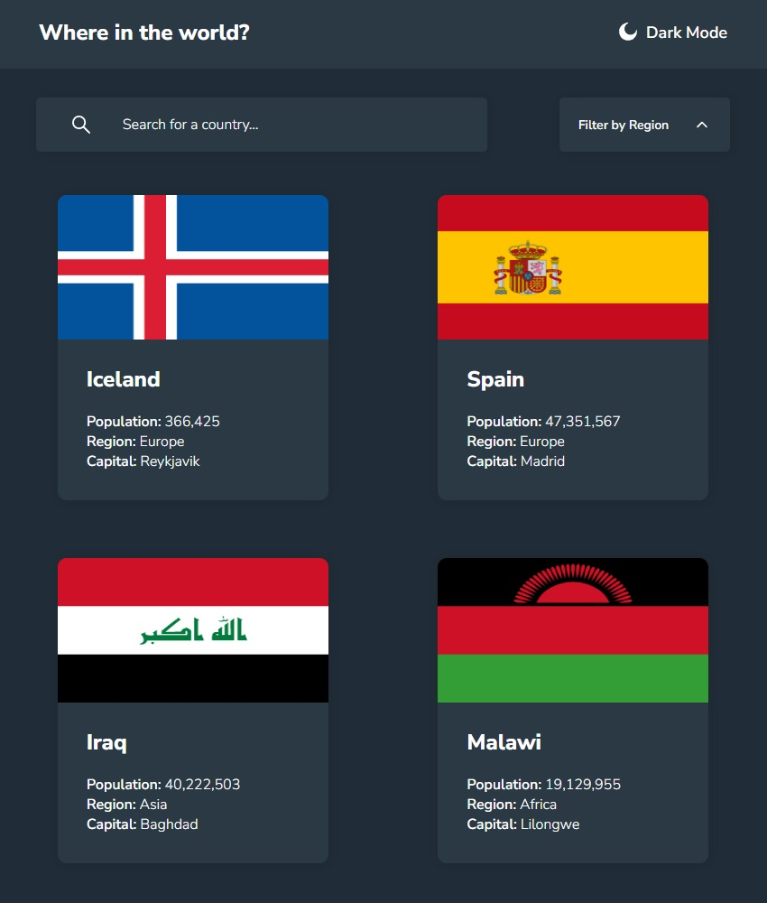

# REST Country API 
This is my solution for the "REST Country API" challenge of Frontend Mentor.

What I like about Frontend Mentor is that they give you some details about what they like to see and sometimes some images but that's about it.
You're not given a solution so it's all on you to try and recreate the project as accurately as possible.

In this challenge I learned about how to use React Router and filters & maps in depth. I also build a few custom hooks, Dark Mode functionality and a controlled search bar. This challenge was loads of fun!

# My Solution
You can find the Frontend Mentor challenge here:
https://www.frontendmentor.io/challenges/rest-countries-api-with-color-theme-switcher-5cacc469fec04111f7b848ca

View my solution at: https://tourmaline-rolypoly-f76373.netlify.app

